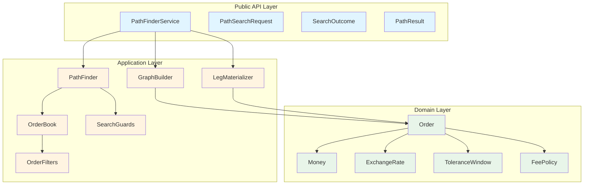
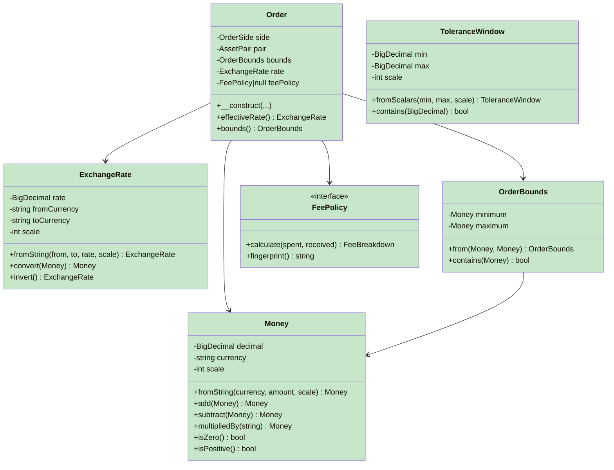
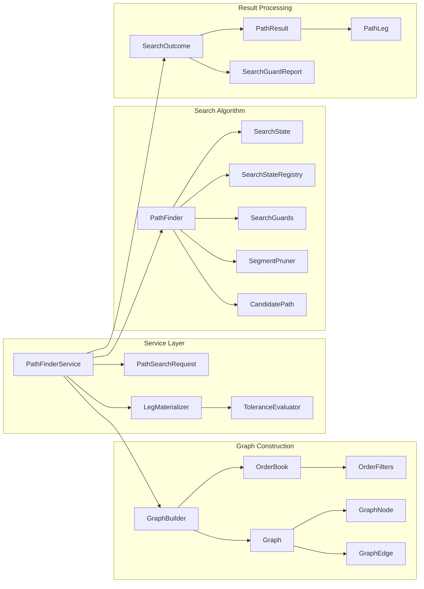
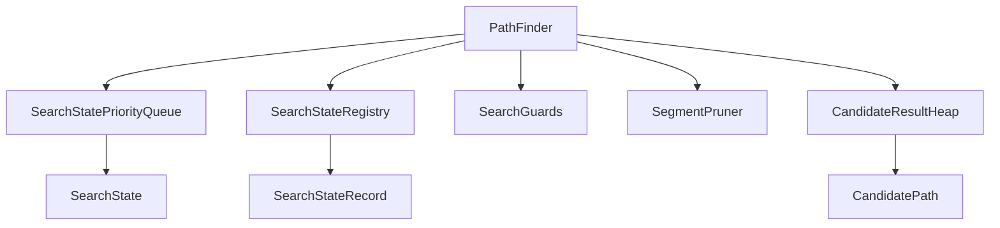
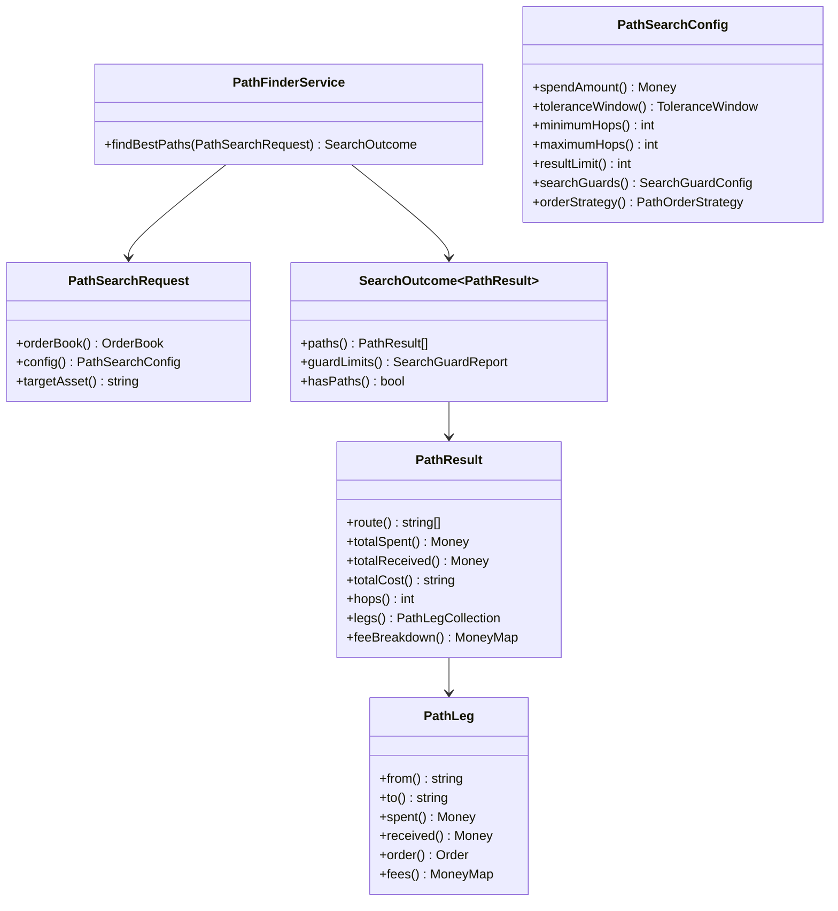
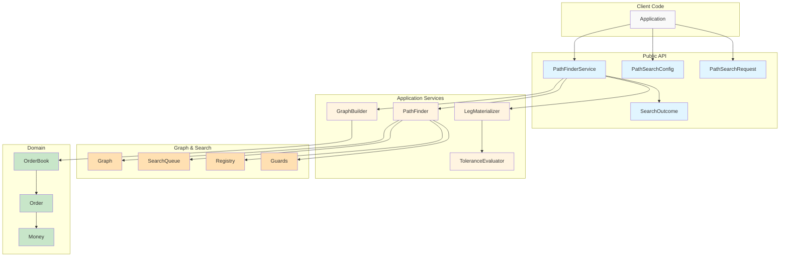
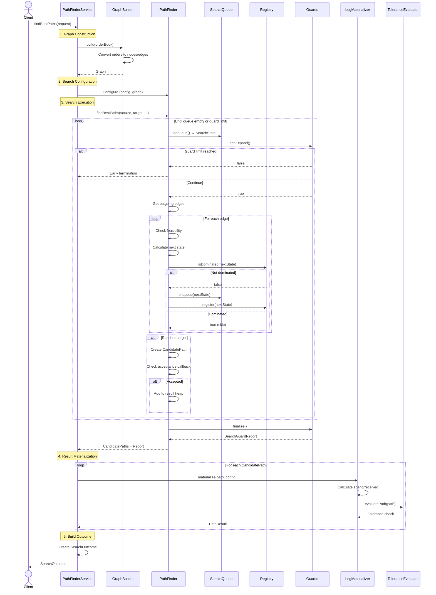

# Architecture

This document describes the architectural design of the P2P Path Finder library, including its layered structure, key components, design patterns, and data flow.

## Table of Contents

- [Overview](#overview)
- [Architectural Layers](#architectural-layers)
- [Domain Layer](#domain-layer)
- [Application Layer](#application-layer)
- [Public API](#public-api)
- [Component Interactions](#component-interactions)
- [Search Flow Sequence](#search-flow-sequence)
- [Design Patterns](#design-patterns)
- [Extension Points](#extension-points)
- [Performance Considerations](#performance-considerations)

## Overview

The P2P Path Finder library is built using **Domain-Driven Design (DDD)** principles with a clean, layered architecture. The library finds optimal multi-hop conversion paths through a peer-to-peer order book while respecting tolerance windows, guard limits, and fee policies.

### Key Architectural Goals

1. **Separation of Concerns**: Clear boundaries between domain logic, application logic, and API
2. **Immutability**: Value objects and DTOs are immutable by design (readonly properties)
3. **Type Safety**: Leverages PHP 8.2+ features (readonly, enums, union types)
4. **Testability**: Clean architecture enables comprehensive unit and integration testing
5. **Extensibility**: Strategy pattern allows custom filters, fee policies, and ordering strategies
6. **Performance**: Optimized graph search with configurable guard rails

## Architectural Layers

The library follows a three-layer architecture:



### Layer Responsibilities

| Layer | Responsibility | Example Components |
|-------|---------------|-------------------|
| **Domain** | Business entities, value objects, invariants | `Money`, `Order`, `ExchangeRate`, `FeePolicy` |
| **Application** | Use cases, graph algorithms, orchestration | `PathFinder`, `GraphBuilder`, `SearchGuards` |
| **Public API** | Entry point, request/response DTOs | `PathFinderService`, `SearchOutcome`, `PathResult` |

### Dependency Rule

**Dependencies point inward**: Application layer depends on Domain layer, but Domain layer has no dependencies. Public API depends on both layers but neither depends on the API.

```
Public API → Application Layer → Domain Layer
   ↓              ↓                    ↓
External      Algorithms         Business Logic
```

## Domain Layer

The Domain layer contains pure business logic with no external dependencies. All domain objects enforce their invariants at construction time.

### Domain Components



### Key Domain Concepts

#### 1. Value Objects (Immutable)

- **Money**: Represents an amount in a specific currency with a scale (decimal places)
- **ExchangeRate**: Represents a conversion rate between two currencies
- **OrderBounds**: Represents min/max amount constraints for an order
- **ToleranceWindow**: Represents acceptable deviation from optimal rate (0 to < 1)

#### 2. Entities

- **Order**: Represents a buy or sell order with bounds, rate, and optional fees
  - **OrderSide**: Enum (`BUY`, `SELL`)
  - **AssetPair**: Value object for base/quote currency pair

#### 3. Domain Services

- **FeePolicy**: Strategy interface for calculating fees
  - Implementations: `PercentageFeePolicy`, `FixedFeePolicy`, etc.

### Domain Invariants

All domain objects enforce invariants at construction:

- **Money**: Amount ≥ 0, currency 3-12 letters, scale 0-30
- **ExchangeRate**: Rate > 0, distinct currencies, scale 0-30
- **OrderBounds**: Min ≤ Max, both positive, same currency
- **ToleranceWindow**: 0 ≤ Min ≤ Max < 1
- **Order**: Bounds, rate, and side are required and valid

See [docs/domain-invariants.md](domain-invariants.md) for complete invariant documentation.

## Application Layer

The Application layer implements use cases and algorithms using domain objects. It contains the graph search algorithm, graph construction, and result materialization.

### Application Architecture



### Key Application Components

#### 1. Service Layer

**PathFinderService** (Entry Point)
- Orchestrates the entire search process
- Builds graph from order book
- Configures and runs PathFinder
- Materializes results into DTOs
- Evaluates tolerance compliance

```php
public function findBestPaths(PathSearchRequest $request): SearchOutcome
{
    // 1. Build graph from orders
    $graph = $this->graphBuilder->build($request->orderBook());
    
    // 2. Run search algorithm
    $searchResult = $this->pathFinder->findBestPaths(...);
    
    // 3. Materialize results
    $materializedResults = $this->materializeResults($searchResult);
    
    // 4. Return outcome with guard report
    return new SearchOutcome($materializedResults, $guardReport);
}
```

#### 2. Graph Construction

**GraphBuilder**
- Converts `Order` entities into a weighted directed graph
- Creates `GraphNode` for each currency
- Creates `GraphEdge` for each order (with segments for fee-based orders)
- Optimizes graph structure for search efficiency

**Graph Components**:
- **Graph**: Container for nodes and provides navigation
- **GraphNode**: Represents a currency with outgoing edges
- **GraphEdge**: Represents an order with capacity bounds and optional segments
- **EdgeSegment**: Represents a portion of an order (mandatory fees vs optional)

#### 3. Search Algorithm (PathFinder)

The `PathFinder` implements a **tolerance-aware best-path search** using:
- **Dijkstra-like algorithm** with cost-based priority queue
- **State registry** for visited state tracking and dominance filtering
- **Guard rails** to prevent runaway searches (expansions, states, time)
- **Segment pruning** for efficient handling of mandatory fees

**Key Search Components**:



**SearchState**: Immutable representation of a search frontier state
- Current node (currency)
- Path taken (edges traversed)
- Accumulated cost (for priority ordering)
- Product received (amount after conversions)
- Spend constraints (valid spend range at current node)

**SearchStateRegistry**: Tracks best-known cost to each node
- Prevents cycles
- Implements dominance filtering (better state → discard worse state)
- Uses unique signature: `{currency}:{hops}:{visited-set}`

**SearchGuards**: Enforces resource limits
- **Expansion limit**: Maximum edge expansions
- **Visited state limit**: Maximum unique states
- **Time budget**: Maximum wall-clock time (milliseconds)

**SegmentPruner**: Optimizes edge traversal
- Prunes zero-capacity optional segments
- Removes optional segments when no headroom exists
- Sorts segments deterministically (mandatory first, then by capacity)

#### 4. Result Processing

**LegMaterializer**: Converts `CandidatePath` to `PathResult`
- Evaluates spend amount for each hop
- Calculates received amount after fees
- Materializes each hop into a `PathLeg` DTO

**ToleranceEvaluator**: Checks if path meets tolerance requirements
- Calculates effective rate vs optimal rate
- Computes residual tolerance for each hop
- Validates path stays within tolerance window

## Public API

The Public API layer provides a clean, stable interface for library consumers.

### API Components



### API Design Principles

1. **Immutability**: All DTOs use `readonly` properties
2. **Type Safety**: Strong typing with native PHP types and PHPStan annotations
3. **Builder Pattern**: `PathSearchConfigBuilder` for fluent configuration
4. **Strategy Pattern**: `PathOrderStrategy`, `FeePolicy`, `OrderFilterInterface` for extension
5. **JSON Serialization**: All DTOs implement `JsonSerializable` with stable contracts

### Configuration (Builder Pattern)

```php
$config = PathSearchConfig::builder()
    ->withSpendAmount(Money::fromString('USD', '1000.00', 2))
    ->withToleranceBounds('0.00', '0.05')  // 0-5%
    ->withHopLimits(1, 4)                   // 1-4 hops
    ->withResultLimit(5)                    // Top 5 paths
    ->withSearchGuards(50000, 100000)       // States, expansions
    ->withSearchTimeBudget(200)             // 200ms
    ->withOrderStrategy(new CustomStrategy())
    ->build();
```

## Component Interactions

### High-Level Component Diagram



## Search Flow Sequence

This sequence diagram shows the complete flow of a path search request.



### Key Flow Steps

1. **Graph Construction** (GraphBuilder)
   - Convert `Order` entities to `GraphNode` and `GraphEdge`
   - Build adjacency structure for efficient traversal

2. **Search Initialization** (PathFinder)
   - Create initial `SearchState` at source currency
   - Initialize priority queue, registry, and guards

3. **Search Loop** (PathFinder)
   - Dequeue state with lowest cost (Dijkstra-like)
   - Check guard limits (expansion, state, time)
   - Expand state by traversing outgoing edges
   - For each neighbor:
     - Check feasibility (spend constraints, capacity)
     - Calculate next state (cost, product, constraints)
     - Check dominance in registry
     - Enqueue if not dominated
   - If target reached:
     - Create `CandidatePath`
     - Check acceptance callback
     - Add to result heap (top-K)

4. **Result Materialization** (LegMaterializer)
   - For each `CandidatePath`:
     - Calculate actual spend amounts per hop
     - Apply fees and compute received amounts
     - Create `PathLeg` for each hop
     - Assemble `PathResult` DTO

5. **Tolerance Evaluation** (ToleranceEvaluator)
   - Calculate effective rate vs optimal rate
   - Check if path stays within tolerance window

6. **Outcome Assembly**
   - Combine materialized results
   - Attach `SearchGuardReport` with metrics
   - Return `SearchOutcome` to client

## Design Patterns

The library employs several design patterns for clean architecture and extensibility.

### 1. Strategy Pattern

**Problem**: Allow customization of algorithms without modifying core logic.

**Implementation**:

```php
// Fee calculation strategy
interface FeePolicy {
    public function calculate(Money $spent, Money $received): FeeBreakdown;
    public function fingerprint(): string;
}

// Order filtering strategy
interface OrderFilterInterface {
    public function accepts(Order $order): bool;
}

// Path ordering strategy
interface PathOrderStrategy {
    public function compare(PathOrderKey $left, PathOrderKey $right): int;
}
```

**Benefit**: Users can inject custom strategies for fees, filters, and ordering.

### 2. Builder Pattern

**Problem**: Complex object construction with many optional parameters.

**Implementation**:

```php
class PathSearchConfigBuilder {
    public function withSpendAmount(Money $amount): self;
    public function withToleranceBounds(string $min, string $max): self;
    public function withHopLimits(int $min, int $max): self;
    public function withResultLimit(int $limit): self;
    public function withSearchGuards(int $maxStates, int $maxExpansions): self;
    public function build(): PathSearchConfig;
}
```

**Benefit**: Fluent, readable configuration with validation at build time.

### 3. Value Object Pattern

**Problem**: Primitive obsession, lack of domain meaning.

**Implementation**:

```php
// Immutable value object with validation
final readonly class Money {
    private function __construct(
        private BigDecimal $decimal,
        private string $currency,
        private int $scale
    ) {
        // Invariants enforced here
    }
    
    public static function fromString(string $currency, string $amount, int $scale): self {
        // Factory method with validation
    }
}
```

**Benefit**: Type safety, domain meaning, encapsulated validation.

### 4. Repository Pattern (Implicit)

**Problem**: Separate data access from business logic.

**Implementation**: `OrderBook` acts as an in-memory repository for orders.

```php
class OrderBook {
    public function filter(OrderFilterInterface ...$filters): Generator;
    public function count(): int;
}
```

**Benefit**: Decouples order storage from search algorithm.

### 5. Facade Pattern

**Problem**: Simplify complex subsystem interaction.

**Implementation**: `PathFinderService` provides a simple facade over complex graph/search subsystems.

```php
// Simple facade over complex subsystems
class PathFinderService {
    public function findBestPaths(PathSearchRequest $request): SearchOutcome {
        // Coordinates GraphBuilder, PathFinder, LegMaterializer, etc.
    }
}
```

**Benefit**: Clients interact with a single, simple API.

### 6. Template Method Pattern

**Problem**: Define algorithm skeleton, allow subclasses to customize steps.

**Implementation**: `FeePolicy` defines calculation contract, implementations customize logic.

```php
abstract class AbstractPercentageFeePolicy implements FeePolicy {
    protected abstract function getPercentage(): string;
    
    public function calculate(Money $spent, Money $received): FeeBreakdown {
        $percentage = $this->getPercentage();
        // Template method: algorithm skeleton
    }
}
```

### 7. Null Object Pattern

**Problem**: Avoid null checks for optional dependencies.

**Implementation**: Optional `FeePolicy` in `Order` (null = no fees).

```php
class Order {
    public function __construct(
        // ...
        private readonly ?FeePolicy $feePolicy = null
    ) {}
    
    public function hasFees(): bool {
        return $this->feePolicy !== null;
    }
}
```

### 8. Priority Queue Pattern

**Problem**: Efficient retrieval of best elements.

**Implementation**:

```php
// Search queue: lowest cost first (Dijkstra)
class SearchStatePriorityQueue {
    private SplMinHeap $heap;
    
    public function enqueue(SearchState $state): void;
    public function dequeue(): SearchState;
}

// Result heap: best K paths
class CandidatePriorityQueue {
    private SplMaxHeap $heap;
    
    public function tryInsert(CandidatePath $path, int $maxSize): bool;
}
```

**Benefit**: O(log n) insertion/removal for efficient search.

## Extension Points

The library is designed for extensibility without modifying core code.

### 1. Custom Fee Policies

Implement `FeePolicy` interface to define custom fee calculation logic:

```php
class TieredFeePolicy implements FeePolicy {
    public function calculate(Money $spent, Money $received): FeeBreakdown {
        // Custom logic: tiered fees based on amount
        if ($spent->amount() < '1000') {
            $percentage = '0.005'; // 0.5%
        } else {
            $percentage = '0.0025'; // 0.25%
        }
        // ...
    }
    
    public function fingerprint(): string {
        return 'tiered:0.5%<1k:0.25%>=1k';
    }
}
```

See [examples/custom-fee-policy.php](../examples/custom-fee-policy.php) for complete example.

### 2. Custom Order Filters

Implement `OrderFilterInterface` to filter orders before search:

```php
class MinimumLiquidityFilter implements OrderFilterInterface {
    public function __construct(private Money $minimumAmount) {}
    
    public function accepts(Order $order): bool {
        return $order->bounds()->maximum()->compareTo($this->minimumAmount) >= 0;
    }
}
```

See [examples/custom-order-filter.php](../examples/custom-order-filter.php) for complete example.

### 3. Custom Path Ordering

Implement `PathOrderStrategy` to define custom path ranking:

```php
class MinimizeHopsStrategy implements PathOrderStrategy {
    public function compare(PathOrderKey $left, PathOrderKey $right): int {
        // Prioritize fewer hops over cost
        $hopComparison = $left->hops() <=> $right->hops();
        if ($hopComparison !== 0) {
            return $hopComparison;
        }
        
        // Then by cost
        return $left->cost()->compareTo($right->cost());
    }
}
```

See [examples/custom-ordering-strategy.php](../examples/custom-ordering-strategy.php) for complete example.

### 4. Custom Acceptance Callback

Provide a callback to `PathFinderService` for fine-grained path filtering:

```php
$service->findBestPaths($request, function (CandidatePath $path): bool {
    // Custom logic: reject paths with specific currencies
    $route = $path->edges()->toArray();
    foreach ($route as $edge) {
        if ($edge->to() === 'BANNED_CURRENCY') {
            return false;
        }
    }
    return true;
});
```

## Performance Considerations

The library is optimized for production use with several performance features.

### 1. Graph Representation

**Adjacency List**: O(1) access to outgoing edges from any node
- Each `GraphNode` stores direct references to outgoing `GraphEdge` objects
- No need for matrix lookups or edge list scans

### 2. Search Algorithm

**Dijkstra-like with Optimizations**:
- **Priority Queue**: O(log n) insertion/removal (SplMinHeap)
- **Visited State Registry**: O(1) dominance checks (hash map by signature)
- **Early Termination**: Stop when top-K results found or guard limits hit

**Time Complexity**:
- Best case: O((V + E) log V) where V = currencies, E = orders
- Worst case: O(G × log G) where G = guard limits (expansions or states)

**Space Complexity**:
- O(V + E) for graph storage
- O(S) for search states where S ≤ maxVisitedStates

### 3. Guard Rails

**Configurable Limits** prevent runaway searches:
- **Expansion limit**: Cap edge traversals (default: 250,000)
- **Visited state limit**: Cap unique states (default: 250,000)
- **Time budget**: Wall-clock safety net (default: none)

**Memory Management**:
- ~1 KB per search state
- ~5-8 KB per order
- Predictable memory usage (see [memory-characteristics.md](memory-characteristics.md))

### 4. Immutability and Caching

**Immutable Value Objects**:
- Safe to share between threads
- Compiler-enforced (readonly properties)
- No defensive copying needed

**Zero Money Cache** (GraphBuilder):
- Reuse zero Money instances for all currencies
- Reduces allocations in graph construction

### 5. Segment Pruning

**SegmentPruner** optimizations:
- Removes zero-capacity optional segments early
- Prunes optional segments when no headroom exists
- Sorts segments deterministically (mandatory first)

**Impact**: 20-50% reduction in edge expansions for fee-heavy order books.

### 6. BigDecimal Precision

**Arbitrary Precision Math**:
- Uses `brick/math` for exact decimal arithmetic
- No floating-point errors
- Deterministic across platforms

**Trade-off**: Slightly slower than float math, but accuracy is critical for financial calculations.

See [decimal-strategy.md](decimal-strategy.md) for precision guarantees.

## Performance Benchmarks

### Typical Performance (PHP 8.3, Xeon vCPU)

| Order Book Size | Mean Time | Peak Memory | Visited States | Expansions |
|-----------------|-----------|-------------|----------------|------------|
| 100 orders      | 25.5 ms   | 8.3 MB      | 500-1,000      | 1,500-3,000 |
| 1,000 orders    | 216.3 ms  | 12.8 MB     | 2,000-5,000    | 8,000-15,000 |
| 10,000 orders   | 2,154.7 ms| 59.1 MB     | 10,000-20,000  | 40,000-80,000 |

**Notes**:
- Benchmarks use k=16 (top 16 paths)
- Default guard limits (250,000 states/expansions)
- Results vary by graph density and hop depth

For detailed performance analysis, see:
- [memory-characteristics.md](memory-characteristics.md) - Memory usage and optimization
- [performance/hotspot-profile.md](performance/hotspot-profile.md) - CPU hotspots

## Summary

### Architecture Strengths

✅ **Clean Separation**: Domain, Application, API layers with clear boundaries  
✅ **Immutability**: Value objects and DTOs are immutable by design  
✅ **Type Safety**: Leverages PHP 8.2+ features for compile-time guarantees  
✅ **Extensibility**: Strategy pattern allows customization without modification  
✅ **Performance**: Optimized graph search with configurable guard rails  
✅ **Testability**: Clean architecture enables comprehensive testing  
✅ **Production Ready**: Predictable memory, deterministic behavior, guard limits

### Key Design Decisions

| Decision | Rationale |
|----------|-----------|
| **Domain-Driven Design** | Clear domain concepts, enforced invariants |
| **Immutable Value Objects** | Thread-safe, no defensive copying |
| **BigDecimal for Precision** | Exact decimal math, no float errors |
| **Strategy Pattern for Extension** | Customization without modification |
| **Priority Queue for Search** | Efficient best-path discovery |
| **Guard Rails for Safety** | Prevent runaway searches in production |
| **Builder Pattern for Config** | Fluent, readable, validated configuration |

### Next Steps

For more information on specific aspects of the architecture:

- **Domain Concepts**: [domain-invariants.md](domain-invariants.md)
- **Decimal Precision**: [decimal-strategy.md](decimal-strategy.md)
- **Memory Usage**: [memory-characteristics.md](memory-characteristics.md)
- **API Contracts**: [api-contracts.md](api-contracts.md)
- **Exception Handling**: [exceptions.md](exceptions.md)
- **Getting Started**: [getting-started.md](getting-started.md)
- **Troubleshooting**: [troubleshooting.md](troubleshooting.md)

